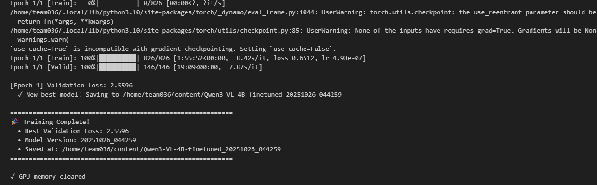

# 📚 문서 디렉토리

이 디렉토리는 SSAFY AI Challenge 프로젝트의 문서를 포함합니다.

## 📂 파일 구조

```
docs/
├── README.md                  # 문서 디렉토리 소개
├── overview.md                # 대회 개요, 미션, 일정
├── dataDescription.md         # 데이터셋 설명
├── methods.md                 # 모델 선택, 파이프라인
├── evaluation.md              # 평가 기준, 리더보드
└── Result.md                  # 최종 결과 및 향후 계획
```

## 📄 문서 설명

### [overview.md](overview.md)

**대회 전체 개요**

- 대회 정보 및 일정
- 미션 소개
- 초기 성능 및 목표
- 최종 성과

### [dataDescription.md](dataDescription.md)

**데이터셋 설명**

- 데이터 구성
- 파일 형식 (train.csv, test.csv)
- 데이터 사용 규칙
- 예시

### [methods.md](methods.md)

**방법론 및 파이프라인**

- 모델 선택 과정
- 학습/추론 파이프라인
- 최적화 전략
- 핵심 코드

### [evaluation.md](evaluation.md)

**평가 기준 및 성능 분석**

- 평가 메트릭
- 리더보드
- 성능 변화 추이
- 종합 평가

### [Result.md](Result.md)

**최종 결과 및 향후 계획**

- 최종 점수
- 개선 아이디어
- 시도하지 못한 방법
- 교훈 및 시사점

## 🏆 주요 성과

- **최고 점수**: 0.91615
- **최종 점수**: 0.87294
- **순위**: 반 2등
- **개선율**: 286% 향상

## 📊 성능 변화



## 🔗 관련 파일

- [프로젝트 README](../README.md) - 프로젝트 전체 개요
- [코드](../notebooks/) - Jupyter 노트북
- [데이터](../data/) - 데이터 파일 (번역 포함)
